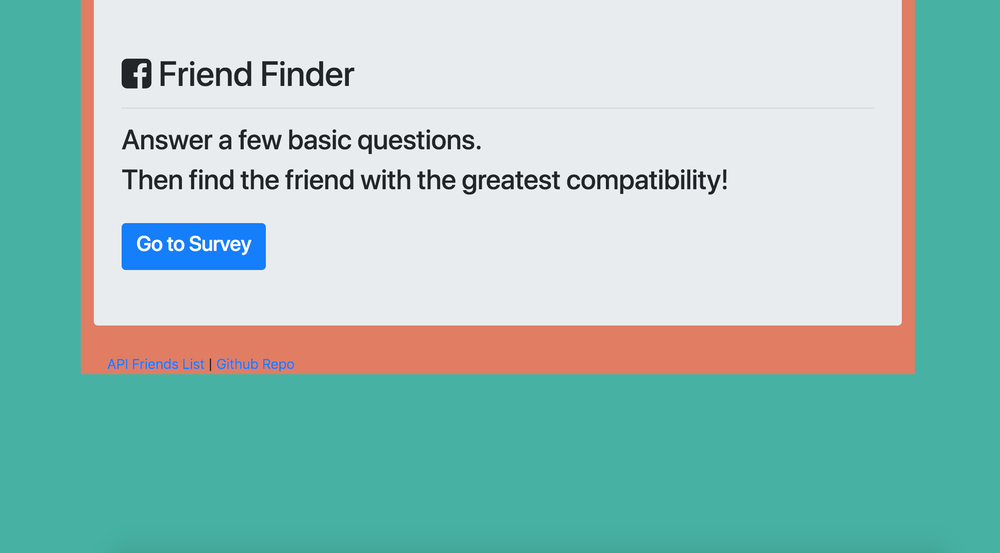
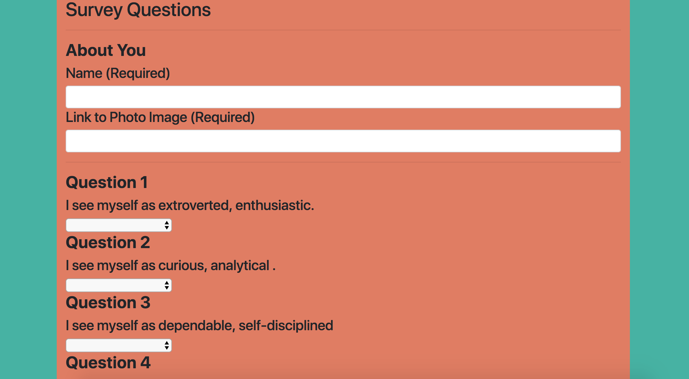
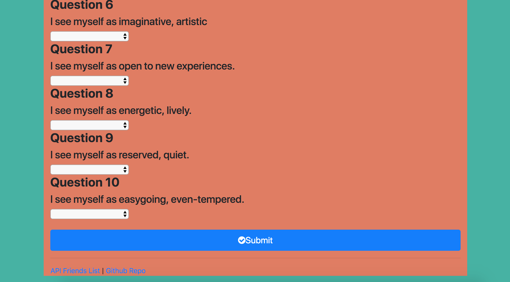
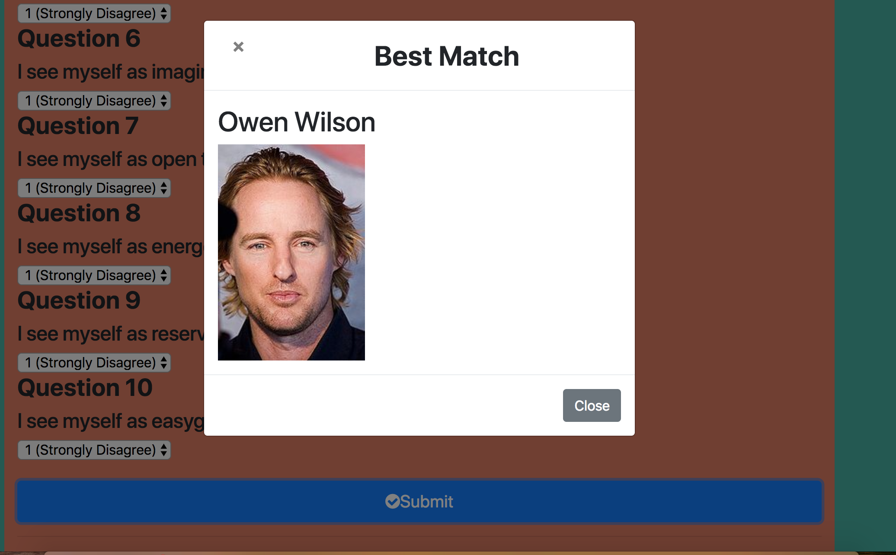
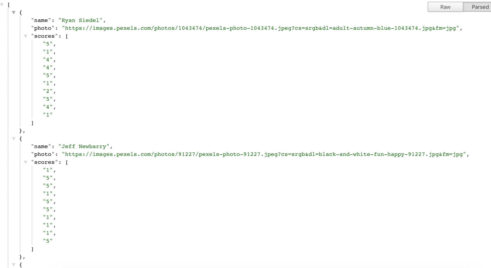

### FriendFinder
 
 - A fullstack match making application using Express package for node
 - link to heroku: https://cryptic-beyond-95899.herokuapp.com/
 
 - This app uses Express to serve two static HTML files and two API routes to get and post data

- Note that data is not persistent, but rather stored in an object in friends.js for your current session

 
 ### Instructions
 - After cloning down the repo to your laptop, run npm install to download the Node dependencies. Then, be sure to serve the app in localhost:8080 in your browser.
 

### Screenshots

## Homepage

## Survey

## Modal

## Api page

 ### Node.js
 Express NPM Package - https://www.npmjs.com/package/express
 bodyParser NPM Package - https://www.npmjs.com/package/body-parser
 

### Built With
Visual Studio - Text Editor

 